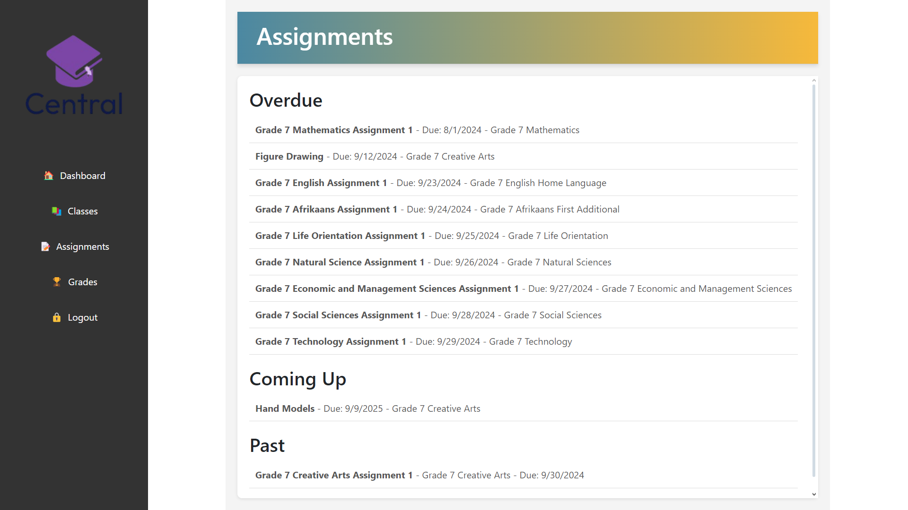
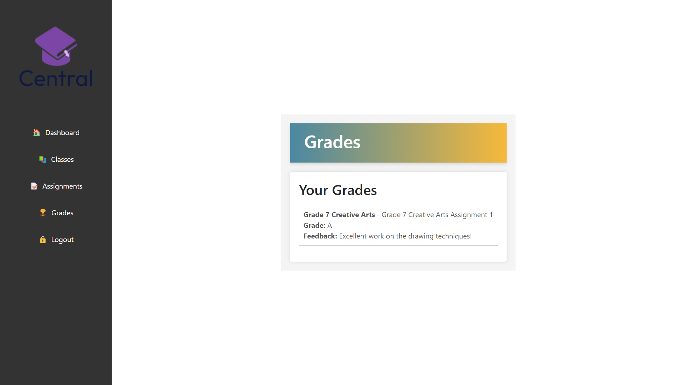

# School Administration App

This project is a web-based school administration application built using React for the frontend, MySQL for the database, and XAMPP for local server management.

## Table of Contents

- [Features](#features)
- [Technologies Used](#technologies-used)
- [Installation](#installation)
- [Database Setup](#database-setup)
- [Running the Application](#running-the-application)
- [Project Structure](#project-structure)
- [Pages](#pages)
- [Demo Video](#demo-video)
- [Screenshots](#screenshots)
- [Usage](#usage)

## Features

- User authentication and authorization (Teacher, Student)
- Student dashboard with assignment submissions, grades, and class enrollment
- Teacher dashboard with class management, assignment creation, and grading

## Technologies Used

- **Frontend**: React.js
- **Backend**: Node.js, Express.js (located in `school-management-backend`)
- **Database**: MySQL
- **Server**: Apache (via XAMPP)
- **Others**: HTML, CSS, JavaScript

## Installation

### Prerequisites

- [Node.js](https://nodejs.org/en/download/)
- [XAMPP](https://www.apachefriends.org/index.html)
- MySQL (included with XAMPP)

### Steps

1. **Clone the repository:**
   ```bash
   git clone https://github.com/MichaelaKemp/231001_Michaela-Kemp_Semester-2_Term-3.git
   cd school-management
   ```

2. **Install frontend dependencies:**
   ```bash
   cd school-management
   npm install
   ```

3. **Install backend dependencies:**
   ```bash
   cd ../school-management-backend
   npm install
   ```

4. **Set up XAMPP:**
   - Install and open XAMPP.
   - Start Apache and MySQL services.

5. **Configure MySQL:**
   - Copy the provided database file (`school_management`) from the `database` directory in the project to your XAMPP MySQL data folder:
     - On Windows: Copy the `school_management` file to `C:\xampp\mysql\data`.
     - On Mac: Copy the file to `/Applications/XAMPP/xamppfiles/var/mysql/`.
   - Access the database with phpMyAdmin via `http://localhost/phpmyadmin/`.

6. **Configure the backend API:**
   - Ensure the database connection details in `server.js` match your local setup.

## Database Setup

Your database should have the following tables:

- **users**: Stores user information (admins, teachers, students).
- **students**: Stores student-specific information.
- **teachers**: Stores teacher-specific information.
- **classes**: Manages classes available in the school.
- **enrollments**: Tracks which students are enrolled in which classes.
- **assignments**: Stores assignment details.
- **submissions**: Tracks student submissions for assignments.

### Sample SQL for Table Creation

Here's a basic SQL snippet to create the `users` table:

```sql
CREATE TABLE users (
  id INT AUTO_INCREMENT PRIMARY KEY,
  username VARCHAR(100) NOT NULL,
  password VARCHAR(255) NOT NULL,
  role ENUM('admin', 'teacher', 'student') NOT NULL,
  created_at TIMESTAMP DEFAULT CURRENT_TIMESTAMP
);
```

## Running the Application

### Start the Backend

```bash
cd school-management-backend
node server.js
```

This command will start the Express server for the backend API on port 3001.

### Start the Frontend

```bash
cd ../school-management
npm start
```

This command will start the React development server on port 3000. Open [http://localhost:3000](http://localhost:3000) to view the app in your browser.

## Project Structure

```
school-admin-app/
├── school-management/
│   ├── node_modules/
│   ├── public/
│   ├── src/
│   │   ├── components/
│   │   │   ├── Login.css
│   │   │   ├── Login.js
│   │   │   ├── Register.css
│   │   │   ├── Register.js
│   │   │   ├── StudentHome.css
│   │   │   ├── StudentHome.js
│   │   │   ├── Assignments.css
│   │   │   ├── Assignments.js
│   │   │   ├── ClassEnrollment.css
│   │   │   ├── ClassEnrollment.js
│   │   │   ├── Grades.css
│   │   │   ├── Grades.js
│   │   │   ├── TeacherDashboard.css
│   │   │   ├── TeacherDashboard.js
│   │   │   ├── ClassManagement.css
│   │   │   ├── ClassManagement.js
│   │   │   ├── AssignmentManagement.css
│   │   │   ├── AssignmentManagement.js
│   │   │   ├── Gradebook.css
│   │   │   ├── Gradebook.js
│   │   ├── logo/
│   │   │   ├── Central Logo.SVG
│   ├── App.css
│   ├── App.js
│   ├── App.test.js
│   ├── index.css
│   ├── index.js
│   ├── logo.svg
│   ├── reportWebVitals.js
│   ├── setupTests.js
│   ├── .gitignore
│   ├── package-lock.json
│   ├── package.json
│   └── README.md
├── school-management-backend/
│   ├── node_modules/
│   ├── package-lock.json
│   ├── package.json
│   ├── server.js
├── database/
│   ├── school_management
└── assets/
    ├── Demo Video.mp4
    ├── Log In.png
    ├── Register (01).png
    ├── Register (02).png
    ├── Student Dashboard.png
    ├── Classes.png
    ├── Assignments.png
    ├── Grades.png
    ├── Teacher Dashboard (01).png
    ├── Teacher Dashboard (02).png
```

## Pages

### Frontend (React):

- **Login** (`Login.js`, `Login.css`): User authentication pages.
  
- **Register** (`Register.js`, `Register.css`): User registration pages.
  
### Pages for Students:

- **StudentHome** (`StudentHome.js`, `StudentHome.css`): Student dashboard page showing enrolled classes, assignments, and grades.

- **Assignments Page** (`Assignments.js`, `Assignments.css`): View assignments, submit work, view grades and feedback on submissions.
  
- **Class Enrollment** (`ClassEnrollment.js`, `ClassEnrollment.css`): View and enroll in available classes.
  
- **Grades** (`Grades.js`, `Grades.css`): A page to view grades for all assignments across different classes.
  
### Pages for Teachers:

- **Teacher Dashboard** (`TeacherDashboard.js`, `TeacherDashboard.css`): Overview of classes they are teaching, assignments pending for grading, and recent student activity.
  
- **Class Management** (`ClassManagement.js`, `ClassManagement.css`): Create and manage classes, view class rosters.
  
- **Assignment Management** (`AssignmentManagement.js`, `AssignmentManagement.css`): Create, edit, and delete assignments, view and grade student submissions.


## Demo Video


## Screenshots





.png)
.png)

.png)
.png)


## Usage

1. **Sign up** as an admin, teacher, or student.
2. **Login** to access the appropriate dashboard based on your role.
3. **Admin** can manage users and classes.
4. **Teachers** can create classes, assignments, and grade student submissions.
5. **Students** can enroll in classes, submit assignments, and view grades.
